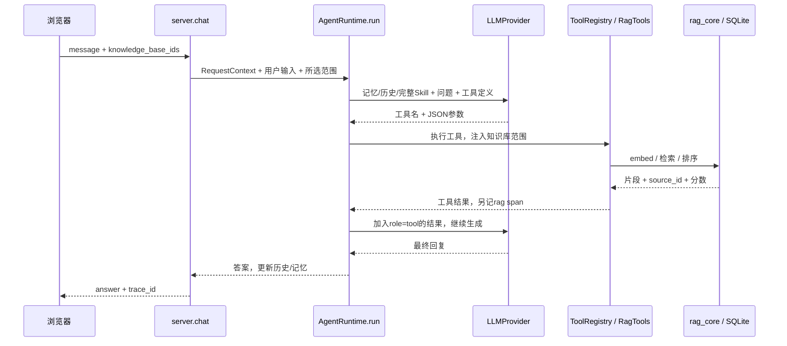

# 三天把“研发文档问答”讲清楚

适用情况：理解 LLM/RAG 的基本原理，但不熟悉这份代码，三天后需要面试 AI 应用开发岗。当前事实、验收和后续实现优先级以 [PLAN.md](PLAN.md) 为准。本文是学习与演示材料，不表示你已经掌握，也不把计划中的能力写成已实现。

先只准备这一个 AI 主项目。Java/Go 助手可以补充语言能力，但不要求三天内同时讲透三个 Agent。模块化和 Jenkins 保留在部署层；介绍项目时先讲用户问题与请求链路，暂时不用背 12 个模块名、全部设计模式或编译细节。

## 1. 项目到底解决什么

目标场景：研发人员面对多份接口、部署和排障文档，需要快速找到答案，并知道答案依据来自哪里。当前实现是个人原型，公开 CMRC2018 语料用于演示；没有企业用户、真实工单处理收益或线上生产规模证据。

用户操作：建立一个笔记本 → 上传文档 → 提问 → 查阅返回的来源 → 点 trace 检查具体查询和命中。Agent 的额外能力是选择检索工具、读回工具结果后继续生成；只读一次向量再拼提示词的固定 RAG 则不需要这个循环。

90 秒介绍草稿（先理解、按实际贡献改写，再说）：

> 我准备的项目是研发文档问答原型，目标是让研发人员从选定文档中查资料，并能检查来源。用户上传文件后，系统转成 Markdown、切块并存储向量。提问时，Python Agent 将模型返回的工具调用交给检索工具执行，把结果放回上下文，再生成回复。检索范围由服务端注入，trace 会记录查询、来源和耗时。部署使用 Docker/Jenkins，业务模块从编译产物加载。目前我能展示离线链路和应用演示测试；真实模型的效果评测、严格证据闸门和持久工作流还需要补齐。

这段不能替代个人贡献：明确哪些是自己写的、哪些由 AI 辅助完成、哪些只是本轮阅读和验证。只有实际做过并能解释的内容，才能使用“我实现了”。

## 2. 只沿着这一条请求读代码



模型可以多轮调用工具，上图只画正常的一次检索。离线 Mock 可能直接原样返回工具 JSON，不能据此说已经验证自然语言答案质量。

| 阅读顺序 | 去哪里找 | 必须回答的一个问题 |
|---|---|---|
| 1 | [server.py](../apps/agent-server/server.py)，找 `chat`、`runtime = AgentRuntime` | 请求有哪些字段，模型/记忆/工具在哪里装配？ |
| 2 | [agent_runtime](../modules-src/agent-runtime/agent_runtime/__init__.py)，找 `run` | 第一次给模型什么，为什么收到工具调用后还要再调模型？ |
| 3 | [llm_gateway](../modules-src/llm-gateway/llm_gateway/__init__.py)，找 `generate` | tool_calls 如何从 HTTP JSON 变成 ToolCall？ |
| 4 | [tool_runtime](../modules-src/tool-runtime/tool_runtime/__init__.py)，找 `execute` | 模型只能返回参数，真正执行函数的是谁？ |
| 5 | [rag_tools](../modules-src/rag-tools/rag_tools/__init__.py)，找 `search`、`_run_search_tool` | scope 从哪里来，返回的引用包含哪些字段？ |
| 6 | [rag_core](../modules-src/rag-core/rag_core/__init__.py)，找 `SqliteVectorStore.search`、`hybrid_search` | 当前如何排序，向量/关键词融合怎么做？ |
| 7 | [ingestion](../modules-src/ingestion/ingestion/__init__.py)，找 `parse`、`chunk` | 文档如何变成块，默认块大小与重叠是什么？ |
| 8 | [skill_runtime](../modules-src/skill-runtime/skill_runtime/__init__.py)，找 `render` | Skill 如何匹配并加载，是否是流程执行引擎？ |

阅读源码用于学习。演示运行仍通过 `runtime_boundary.py` 加载 artifacts 下的 `.pyd/.so`。本机有旧二进制签名与新源码不一致，不能以源码看起来正确代替交付验证。

第一题现在就练：“请查资料，说明当前项目向量存储怎样实现。”尝试不看文档说出：接收请求 → 构造 trace 上下文 → 载入历史和 Skill → 模型选择 search → 注入 scope → SQLite 中读向量并点积排序 → 带来源回传 → 第二次生成。卡住时只回到对应函数。

## 3. 岗位要求怎样对应到证据

| 岗位能力 | 当前可以展示 | 当前缺口 / 三天内怎么处理 |
|---|---|---|
| Python 开发 | FastAPI 请求、异步 provider、工具注册、分块/排序 | 手工解释一处函数，自己改一项低风险提示词或演示问题并观察结果 |
| LLM 基础与提示词 | 系统提示词、tools schema、role=tool、上下文历史 | 讲清 token/context window、采样不确定性、幻觉和工具调用；项目没有训练/微调 |
| RAG | 文档转换、字符分块、检索、结构化来源、笔记本 scope | 真实 BGE/LLM 效果未在本轮验证；hash 是测试向量，不是语义模型效果 |
| Agent | 模型选择工具、执行结果回传、循环上限 | 未做自主长期任务；选过工具不等于执行成功 |
| 工作流编排 | 自写模型—工具循环 | 没有持久状态图、暂停/恢复、审批建单。Skill 写着步骤不能代替工作流 |
| Agent Skill | 按 always/触发规则加载完整 SKILL.md | 解释“可复用操作说明”，不称为自治规划器 |
| Harness Engineering | 上下文装配、工具范围、文件边界、轮数、trace、现有测试 | 当前有部分运行约束；无严格引用验证、完善授权和恢复机制，讲清现有与缺失 |
| LangChain/LangGraph/Hermes | 当前实现未使用 | 显式承认缺口，阅读/运行官方小例子后仅称“独立练习过” |
| 稳定/高效/安全 | 构建闸门、候选健康检查与回滚配置、文件目录限制 | 无本轮压测、无用户鉴权，不声称生产级或高并发 |
| 效果迭代 | 可查看 query、命中来源、耗时和工具轨迹 | 做下方固定案例记录；不能用 Mock、词面分数或答案长度报准确率 |

学历、专业与毕业届别按真实经历核对，项目不能替代职位的硬条件。

框架只优先理解一个具体问题：如果任务需要跨进程重启继续、人工确认再写操作，自写循环需要补状态持久化与恢复。LangGraph 官方区分固定路径的 workflow 与模型动态选择的 agent；interrupt 需要 checkpointer 和 thread_id，恢复时节点可能重跑，所以前置副作用要考虑幂等。[workflows/agents](https://docs.langchain.com/oss/python/langgraph/workflows-agents)、[interrupts](https://docs.langchain.com/oss/python/langgraph/interrupts)。

三天内有余力时，最多花一小时跑官方批准/拒绝例子并解释 state/node/edge、暂停/恢复，保存在个人练习环境；不接入当前产品，不因此写“本项目用 LangGraph 实现”。完成这一步以前仍是资料学习。

JD 的 Hermes 具体所指未得到官方招聘页确认。如果指 NousResearch Hermes Agent，先通过[官方仓库](https://github.com/NousResearch/hermes-agent)了解其 agent/工具/skills 体系，面试可澄清指代；当前项目未接入，三天内不安排整个平台迁移。

## 4. 准备三个设计取舍

每个回答使用“遇到的问题 → 选择 → 代价 → 下一步”的顺序。

**为什么增加 Agent 循环？** 问题可能需要换查询、精确查术语或读原文，工具返回后由模型决定下一步。代价是多次模型请求带来延迟、费用和不确定性。简单问答可以选固定检索流水线；本项目尚无消融实验，不能声称 Agent 比固定 RAG 更准确。

**为什么传 scope？** 同一个服务中有不同笔记本，检索必须只查当前选择。`ToolRegistry` 在执行时注入 runtime_context，`RagTools` 使用其中的知识库范围，分页读原文也核对 source_id。代价是检索可能无结果；而用户选择范围不等于后端鉴权，未来需在取得用户身份后再核验访问权。

**为什么使用 SQLite？** 个人原型易复现、无需另建数据库；当前向量保存为 JSON，点积搜索适合小数据验证。代价是搜索需要扫描读取，规模扩大后会慢；没有实现 pgvector/ANN，不能说“向量库可无痛切换”。

部署追问时再补：接口契约与编译交付便于固定模块边界、检查版本来源；代价是构建复杂、跨平台 ABI 限制和源码/产物一致性风险。本项目的三处本机签名不一致正是一个待解决的例子。Cython 没有经过性能对比，不声称它让推理更快；二进制也不提供绝对保密。

## 5. 五分钟演示：先证明查到了什么

1. 先在服务器公开入口按第 10 节完成精选问题、来源与 trace 演示。下面的上传步骤只适用于受保护的私有工作区，公开演示不开放上传。本机启动是可选练习，需匹配二进制工件；不使用源码模式绕过边界。
2. 首先展示已有 CMRC2018 笔记本和“请查资料，什么是静电感应？”。核对 trace 中存在 rag span、scope 是当前笔记本、命中来源来自该范围。
3. 建一个独立笔记本“项目说明练习”，手动上传本仓库最新 README.md 与 docs/ARCHITECTURE.md。上传的是公开项目说明，避免用企业或个人敏感文档。不要上传本学习指南，免得检索把练习答案与项目事实混在一起。
4. 问“请查资料，当前向量存储是 FAISS 吗？”先看命中片段，再看答案。资料应说明 SQLite JSON 向量/NumPy 排序。Mock 只检查返回 JSON 与来源；接入真实模型以后才核对自然语言答案是否忠实。
5. 点 trace，说明一次查询、命中数、source_id、score、rag/llm/tool 耗时各说明什么。分数表示检索排名依据，不是答案正确概率。
6. 问“请查资料，当前是否已实现持久工作流或接入 Web MCP？”让演示暴露边界；答案应对应文档写的尚未实现/接入。当前真实模型未复验，不能保证现场会正确回答。

演示遇到错误先保留 trace 和输入，定位上传/embedding/工具/LLM/生成哪一步失败。网络、模型或认证失败时展示事先保存的真实记录与离线链路，明确说明模式；不能把录像或固定 Mock 文本说成正在执行的真实模型结果。

API 手动复演（已启动本机服务时；本段会调用当前配置的 provider，真实模型可能计费）：

```powershell
$interviewBody = @{
    user_id = 'interview-practice'
    session_id = 'practice-01'
    message = '请查资料，什么是静电感应？'
    knowledge_base_ids = @('cmrc2018-demo')
} | ConvertTo-Json
$interviewReply = Invoke-RestMethod -Uri 'http://127.0.0.1:8000/api/chat' `
    -Method Post -ContentType 'application/json; charset=utf-8' `
    -Body ([Text.Encoding]::UTF8.GetBytes($interviewBody))
$interviewReply
Invoke-RestMethod -Uri ('http://127.0.0.1:8000/api/trace/' + $interviewReply.trace_id)
```

## 6. 六个固定案例，先记录失败再谈提升

| 案例 | 输入/操作 | 应看见什么 | 如何判断 |
|---|---|---|---|
| 命中文档 | 项目说明笔记本：“请查资料，当前向量存储是 FAISS 吗？” | SQLite/NumPy 相关来源 | 来源命中和答案忠实分开评分 |
| 能力边界 | “请查资料，Web 现在接入 MCP 了吗？” | 尚未接入 Web 的依据 | 不能把独立模块冒充主链路 |
| 未提供信息 | “请查资料，生产系统每天服务多少用户？” | 文档无生产规模数据 | 真实模型应说无法据资料确认；当前不是硬性拒答保证 |
| 知识库范围 | 切回 CMRC2018，再问 FAISS 问题 | trace 的来源全部属于 CMRC2018 | 不得检出项目说明笔记本；无相关资料要单独记录 |
| 不检索的模型 | 阅读 `test_reminders_are_bounded_and_never_loop_forever` | 最多两次提醒后仍返回未检索答案 | 已知失败边界；不要把“提醒过”算成检索成功 |
| 后续追问 | 同一会话追问上次问题，再换会话 | 核对实际上下文与记忆行为 | 进程内历史有联合键，SQLite 记忆缺 session_id 过滤；不能声称绝对隔离 |

自己建立记录表，每条记：模式（Mock/真实模型、hash/BGE）、问题、所选笔记本、期望来源、实际来源、答案关键结论、trace_id、总耗时、是否通过、失败原因。可以留在被忽略的 reports/，不用提交一次性报告。

检索指标示例：先标注每题相关文档，再计算 Recall@k = 前 k 个检索结果覆盖的相关文档数 / 所有标注相关文档数。答案正确性由人工依据文档检查，与检索命中率分开。小样本要报分子/分母；某条用例通过不能说成“项目准确率提升”。质量比较至少固定同一问题集、语料、模型/embedding、检索 k 与提示词，只改变一个变量并保留失败记录。

现有 `evaluation.evaluate_qa` 的 faithfulness 是词面重叠、answer_relevance 是答案长度启发式；不适合直接作真实质量结论。上述表是可执行的人工复演计划，本轮没有生成真实模型的六例效果分数。

## 7. 三天安排与过关标准

| 时间 | 做什么 | 当天必须交给自己看的结果 |
|---|---|---|
| 第一天，约 4 小时 | 20 分钟讲用户问题；2 小时按第 2 节读链路；1 小时复演服务器公开流程并看 trace；40 分钟脱稿复述 | 手画一条请求图，解释两次 LLM 请求，指出 5 个关键函数，录一段 90 秒介绍 |
| 第二天，约 4 小时 | 执行固定案例；整理三个设计取舍；能访问受保护私有工作区时再建项目说明笔记本；有余力再做 LangGraph 独立练习 | 一份带模式/来源/失败原因的记录表，5 分钟演示录像；每项设计都能说出代价 |
| 第三天，约 3 小时 | 两轮模拟问答；修订简历中夸大的能力；准备截图/trace/离线备用；停止加功能 | 90 秒介绍 + 5 分钟演示 + 下方追問；至少能解释一项自己做的修改 |

如果当天只有两小时，优先请求链路、演示和设计取舍；框架练习降为阅读并如实说明。若链路仍讲不清，继续缩小介绍到“文档上传、检索、来源、trace”，不用硬讲记忆/MCP/编译全部细节。

每次练习不要直接背答案：先自行解释 → 对照对应函数 → 找一处错误 → 重新说一次。录音里出现“框架会自动处理”“应该已经做了”时，回到具体实现找证据。

## 8. 面试追问速查

| 问题 | 回答必须包含 |
|---|---|
| RAG 为什么不等于微调？ | 文档在推理时检索并加入上下文，模型权重未改变；资料可更新，但检索错仍会导致错误 |
| 分块参数是什么？ | 当前按抽取段落/页后按字符切块，默认 500 字符、50 重叠；不是 token 切分，也不是调参最优结论 |
| 混合检索如何融合？ | 向量与词面两路排名，用加权 RRF；默认 alpha=0.5，按 1/(60+rank) 融合，不直接加不同尺度的原始分数；没有另加 reranker |
| 模型如何调用 Python？ | 模型输出工具名/JSON，服务解析成 ToolCall，注册表调用函数，结果以 tool 消息回传；模型本身没有执行 Python |
| Skill 与 tool 有什么关系？ | Skill 提供可复用操作指令，tool 是可执行函数/能力；本项目 Skill 不是审批/恢复状态机 |
| Harness 在哪里？ | 上下文与工具装配、检索范围注入、轮数限制、文件边界、trace 和验收测试；指出 guard 与授权仍有缺口 |
| 为什么不是生产系统？ | 缺鉴权、压测、严格证据验证、持久工作流恢复与可信评测；小数据扫描式检索也有容量限制 |
| 有流式输出吗？ | 有 SSE 传输接口，完整生成后只发一次，当前没有逐 token 生成 |
| 多会话安全吗？ | 历史按用户/会话放内存，SQLite 记忆仅按 namespace/user_id；客户端 user_id 不是可信身份，隔离仍需补 |
| 性能如何？ | 展示一次 trace 耗时并限定模式和样本；无 p95、并发或成本基准，不能报虚构数字 |
| 用了 LangGraph 吗？ | 本项目自写循环；如独立例子确实运行成功，可单独讲练习，明确未集成 |
| 你本人负责什么？ | 具体文件、修改原因、验证步骤、失败记录；准确区分自主完成与 AI 辅助，不背无法证明的贡献 |

简历可以先使用中性条目：“研发文档问答原型：支持笔记本内文档检索、结构化来源与调用 trace；实现/参与了【填自己能解释的具体部分】，通过【填真实运行的验证】核对流程。”删去没有证据的“生产级、准确率提升 X%、高并发、完善多租户、全框架熟练”等表述。

## 9. 当前核验结果怎样说

2026-10-08，本机现有 Windows CPython 3.11 工件：

- `RAG_EMBED=hash` 下二进制运行验收输出 `COMPILED_AGENT_OK`。
- 临时 STATE_DIR、空模型 key、hash 模式的应用演示测试 7 项通过。
- 额外 API 上传复演因系统临时目录写权限失败，提升权限请求未获批准；完整“新建→上传→问答→trace”未列为本轮已通过项。第 5 节是待操作者实际复演的步骤。
- 契约检查 11 项通过、90 个 subtests 通过、3 个 subtests 失败，涉及 llm-gateway/observability/evaluation 的本机旧产物签名。不能说交付闸门全绿；需在目标构建流程核实重建。
- 对“不检索的 provider”进行本机二进制复演：记录两次 retrieval_guard，随后仍返回 `UNRETRIEVED_ANSWER`。因此必须把提醒和严格保证区分开。

以上是第一阶段本机历史结果，不代表真实 DeepSeek/BGE 质量评测。服务器公开演示是随后新增的执行范围，最终交付记录以 PLAN 文末为准。

复验命令（现有匹配环境中）：

```powershell
$env:RAG_EMBED = 'hash'
.\.venv\Scripts\python.exe scripts/verify_compiled_runtime.py
.\.venv\Scripts\python.exe -m pytest contracts/test_contract.py -q

# 应用测试在独立进程中使用临时状态，避免覆盖已有数据库；不影响模型密钥文件。
$env:STATE_DIR = Join-Path $env:TEMP ('dev-agent-interview-' + [guid]::NewGuid().ToString('N'))
$env:DEEPSEEK_API_KEY = ''
.\.venv\Scripts\python.exe -m pytest apps/agent-server/tests/test_cmrc2018_demo_workflow.py -q
```

执行测试后关闭这个终端，避免 hash/空 key/临时状态环境设置影响正式演示。应用测试在某些情况下可能建立临时用户笔记本，现有测试会清理；本轮运行后 Git 工作区只出现文档改动。

## 10. 主页演示怎样讲清楚

打开主页的“研发文档问答演示”，选一个精选问题，再查看回答、检索来源和执行记录。CMRC2018 是用于复现流程的公开阅读材料；标题中的研发文档问答是目标业务，本次公开数据不是企业内部研发数据。

依次解释这四件事：

1. 浏览器只发送一个固定问题。HTTP 适配层设置 CMRC scope 和独立身份，禁止上传、写工具及浏览器密钥。
2. AgentRuntime 通过工具注册表调用已发布的 RAG 二进制，工具结果进入下一次模型请求；有 trace 才能核对是否发生检索。
3. 公开适配层在返回前检查成功 rag span、非空命中及 CMRC 来源。这个附加门禁只作用于公开接口，不宣称私有 Agent 的两次提醒已变为严格证据保证。
4. Jenkins 先跑模块单测、编译、契约和应用检查，候选服务实际问答通过后才切换。源码供构建和学习，运行镜像通过二进制来源检查启动。

问到取舍时说明：固定问题、单并发和五分钟缓存控制公开演示范围；缓存复用原答案和原 trace，不算本次模型调用。hash 便于小服务器启动，不能代表中文语义向量质量。命中来源证明检索执行过，尚不证明答案每句话都有证据支持。

练习时先自己指着页面说出请求路径，再打开 `apps/agent-server/public_demo.py` 的 `chat()` 与 `_has_retrieval()` 核对。至少亲手修改一个显示文案或固定问题后的校验，解释修改为何通过或被拒绝；个人贡献仍应按实际参与描述。
